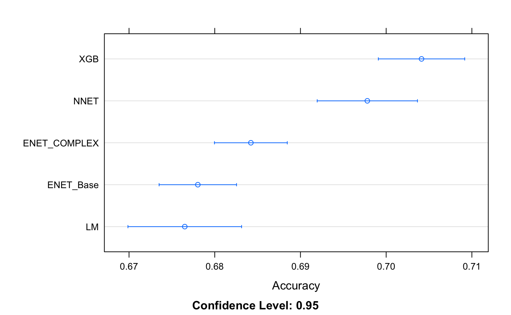
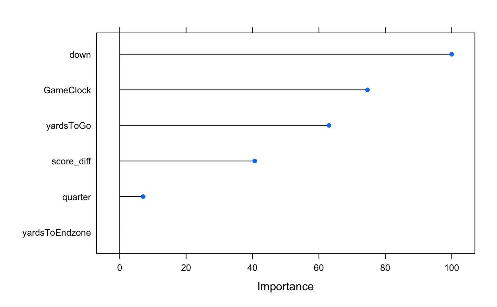
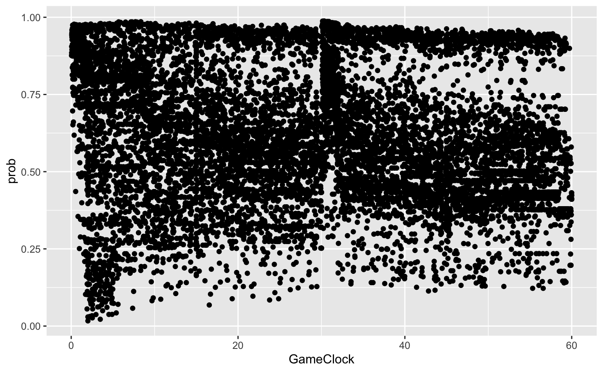
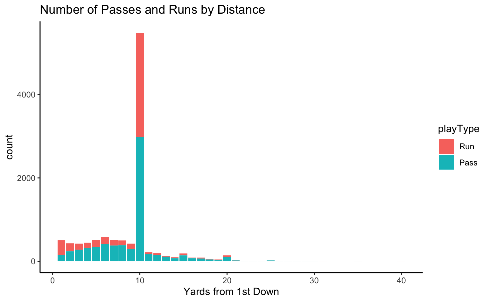
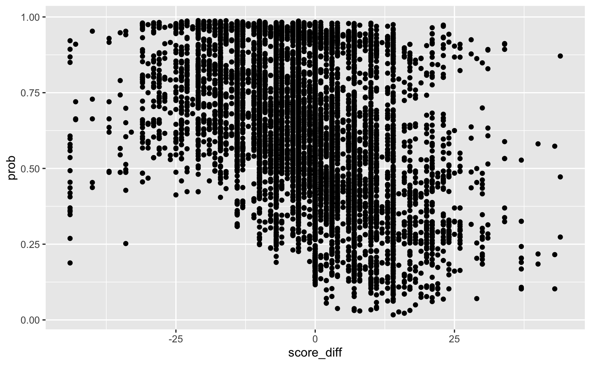
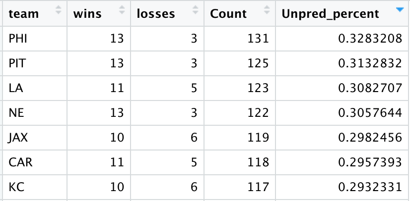
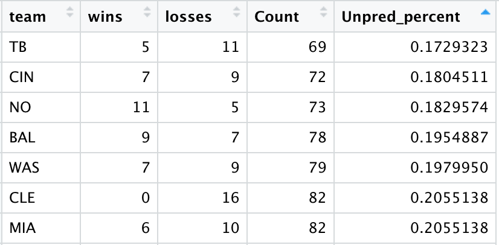

# NFL Unpredictability

## Introduction 
My data comes from the 2017-2018 NFL Big Data Bowl contest repository on Github. The dataset I used for this project contained play data from every game for the first 6 weeks of the 2017 NFL regular season. The goal of the project is to be able to accurately predict whether or not a play will be a run or a pass based on various factors such as down, first-down distance, distance from endzone, and more.
This model’s main purpose is to measure how unpredictable NFL teams are with play calls and if unpredictability can lead to success. The job of an NFL coach is to be unpredictable with their play calls so that the opposite team can’t predict whether the play will be a run or a pass. At the end of the project, I will be able to determine which teams were the most unpredictable over the first 6 weeks, and if being unpredictable led to more success. As far as I have seen, this topic hasn’t been widely researched on a play-by-play level which seems odd since play-calling is a big part of a coach’s job and can really dictate the success of a team if done correctly, or if not done correctly, can become an extreme detriment of the team.
## Data Collection
The dataset used for this project was read directly from the NFL Big Data Bowl’s Github page into R for analysis. The dataset included additional line of scrimmage info such as offensive formation scheme, defensive formation scheme, and description of the play but all of this data comes post play-call so it is not logical to use in the model. The dataset included the home and away teams’ score before and after the play, however it did not include the home or away teams’ name in the dataset, so in order to extract the offensive team’s score I only looked at scoring plays (plays where score before play doesn’t equal score after play) and matched the possession team with the team whose score changed. It made more sense to include the score as one continuous variable in the dataset so only the score difference (offense’s score minus defense’s score) was included in the final dataset. Specific plays had to be excluded from the dataset such as special team plays such as punts and field goals, and set plays such as kickoffs and extra points attempts. The original dataset only included a “yardline” variable that consisted of a number 1 through 50 and another variable that contained the side of the 50-yardline the offense was on indicated by the team’s name. These two variables were transformed into one continuous variable “yards from endzone” that contained the distance the offense needed to go in order to reach the endzone. The “game clock” variable stored the time remaining in the quarter; however, this is not easy for the model to analyze so this variable was transformed into a continuous variable that represented the time left remaining in the game. Based off the variable “pass result” which indicated whether the play resulted in a completion “C” or incompletion “I” the new variable “play type” was created to indicate whether the play was a pass, or a run if a value for the pass result variable was missing. 

## Inferential Statistics 

Several models were fit using quarter, down, time remaining, first down distance, score differential, and distance from endzone. The results of the models are grouped together in the graph below:

The gradient boosted tree performed the best with a play prediction accuracy of around 70%. This is the model that was used to make the final play predictions on the dataset.

The down variable was identified as the most important variable in the model and based off the bar graph that was analyzed above as down increases the likelihood of a pass would see a significant increase. Other significant variables included the time remaining (GameClock), first down distance (yardsToGo), and score differential (score_diff). It is very interesting that the distance from endzone was not considered to be important in the model prediction since teams are usually more likely to run as they get closer to the endzone. 

The predicted probability of a pass compared to time remaining is for the most part very random, but at around the thirty-minute mark and when there is little time remaining the probability of pass being close to one is much more likely. Especially, at the thirty-minute mark, just before halftime, as passing becomes much more common for NFL teams. At the end of games, there is also a cluster of extremely low pass probabilities, these situations represent teams that have a large lead and are trying to “run the clock out” so that the other team has little time left to make a comeback and win the game.

The next graph pictured above depicts pass probability in respect to down and first down distance. First downs all typically start with the same standard distance of ten yards, however penalties can change exactly how far the play is from the first down. As predicted, first down and ten yards has an extremely wide range of values that go from close to zero to one. Second and third down both follow a similar trend as one another, which is as distance decreases the expected likelihood of a pass decreases. This same trend becomes extreme in the fourth down graph and at distances further than two yards a pass is extremely likely but within two yards a run is much more likely.

As the difference between the offense’s score and the defense’s score increases the predicted probability of a pass decreases. In games where the scores are close it is much harder to predict whether the play will be a run or pass since running or passing doesn’t inherently benefit the team in a specific way.

The next step of the project was building three new models: one to predict the expected yards gained for a completion, one to calculate the probability of completing a pass, and another to predict expected yards gained for a run. Expected passing yards was calculated using the following formula:

$Expected.Passing Yards = Predicted.Passing Yards * Predicted.Completion Probability$

The average yards per completion in the NFL over the first six weeks of the 2017 season was eleven yards and the average yards per run over that same span was around four yards, so to no surprise, the predicted passing yards was almost always larger than predicted running yards. However, when the probability of completing a pass was taken into account the difference in expected yards gained for both a pass and a run only differed by a yard on average and in some cases, runs were identified as better than passes. These scenarios often occurred when the offense was either at the goal line or close to their own endzone where passing is very risky. The average pass completion probability from the model was 63% and, in the NFL, the average completion percentage is around 67% so the model isn’t far off from the actual average. 

## Conclusion

In the end, an accurate model was able to be created to predict whether a play in the NFL would be a pass or run, subsequent models were created to predict expected yards gained from either passing or running in each situation. With only these tools, NFL analytic teams could gai valuable insight into common behavior in the NFL and identify real game-time scenarios in which to provide insight to coaches. To take this project a step further would be to analyze each individual play-caller/coach in the NFL and analyze their play-calling habits. Having the ability to effectively prepare your defense for a run or pass can provide a significant boost to the players and during the game a split-second difference in decision-making can have significant effects on player performance.

The seven most unpredictable teams identified by the model are listed above. Unpredictability percentage in this case represents the percentage of times the model incorrectly predicted a pass or run for that team in the dataset. The most unpredictable teams were the most successful in the 2017 season. For example, the Philadelphia Eagles were the most unpredictable team through the first six weeks of the season, and they ended up winning the Super Bowl this year and becoming NFL champions. 

The following list of teams represents the teams who were the most predictable throughout the first six weeks of the NFL season and unsurprisingly the majority of the top seven most predictable teams finished with below average records and most did not make the playoffs. The New Orleans Saints are the only exception amongst the predictable teams that was successful throughout the season and did make the playoffs. Unpredictability is not a flawless measurement of success and there are certainly exceptions to this link, but it is extremely interesting, and I believe that as analytics improves in sports it will become more important than ever for coaches to be unpredictable and catch the defense off guard in order to be successful. 
The Philadelphia Eagles famously pulled off one of the greatest and most unpredictable plays in Super Bowl history at the end of the 2017 season which has now become known as “The Philly Special.” The Eagles were at the goal line on fourth down and during the play the running back took the snap instead of the quarterback and the quarterback leaked out and caught the pass in the endzone with no defenders nearby. This play is just one example of how creativity and ingenuity can lead to success in the NFL and how a simple play call can change history as we know it.

